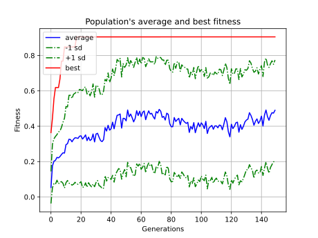
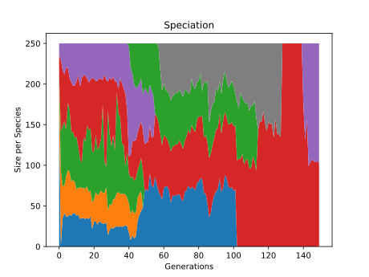
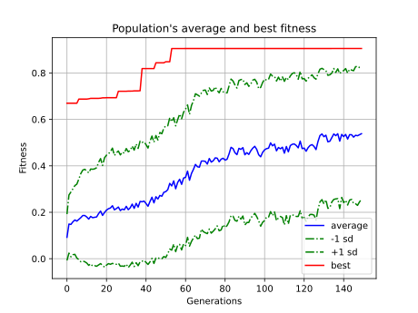
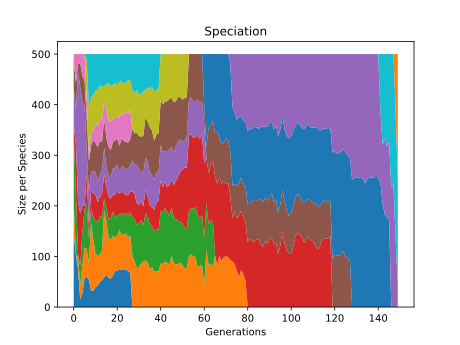

# Лабораторная работа №3

*Автономное прохождение лабиринта (целеориентированная функция приспособленности)*

## Структура проекта:

```
lab_work_3/
├── img/                                # Все результаты экспериментов
├── src/                                # Исходный код проекта
|   ├── Graphviz-14.1.5-win64/          # Graphviz для визуализации графов
|   ├── out/                            # Текущие результаты экспериментов
|   ├── .gitignore
|   ├── agent.py                        # Определение агента
|   ├── geometry.py                     # Геометрические примитивы
|   ├── hard_maze.txt                   # Сложная конфигурация лабиринта
|   ├── maze_config.ini                 # Гиперпараметры
|   ├── maze_environment.py             # Среда лабиринта
|   ├── maze_experiment.py              # Запуска экспериментов для среднего и сложного лабиринтов
|   ├── medium_maze.txt                 # Нормальная конфигурация лабиринта
|   ├── requirements.txt
|   ├── utils.py                        # Набор вспомогательных функций
|   └── visualize.py                    # Визуализация лабиринта и траектория движения агента
└── README.md
```

## Medium Maze

### Эксперимент №1

```bash
python maze_experiment.py -m medium -g 150
```






### Эксперимент №2

```bash
python maze_experiment.py -m medium -g 150
```

```Python
pop_size = 500 # 250
feed_forward = True # False
node_add_prob = 0.5 # 0.1
conn_add_prob = 0.7 # 0.5
```




